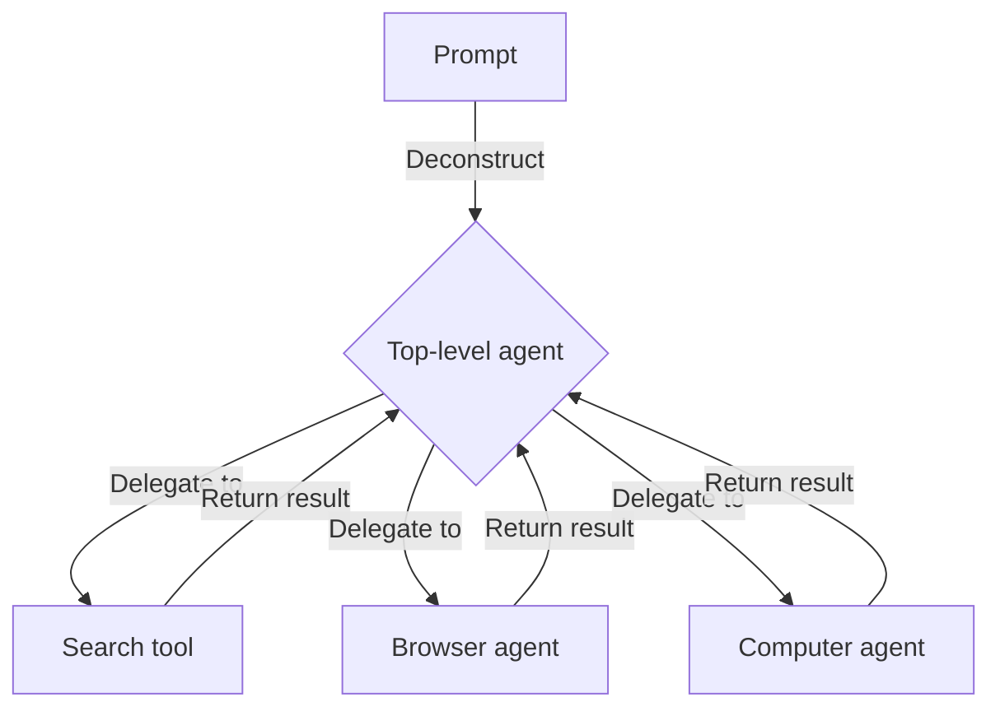
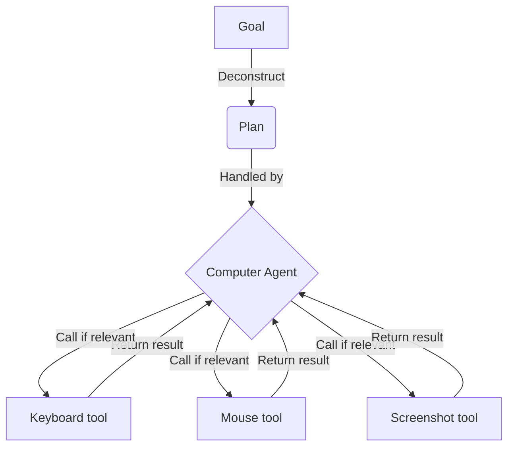

# Agentflare


This project provides an agent that can use a [web browser](#using-chromium) and a [computer](#using-computer) to fulfill tasks specified by a user using Cloudflare [Workers](https://developers.cloudflare.com/workers/) plus [Containers](https://developers.cloudflare.com/containers/).

## Contents

* [Why](#why)
  * [General](#general)
  * [Expensive](#expensive)
* [Usage](#usage)
  * [Search example](#search-example)
  * [Browser example](#browser-example)
  * [Computer example](#computer-example)
  * [Search and browser example](#search-and-browser-example)
* [Architecture](#architecture)
  * [Using Chromium](#using-chromium)
  * [Using computer](#using-computer)
* [Running](#running)

## Why?

### General

This was motivated by the [ChatGPT Agent](https://openai.com/index/introducing-chatgpt-agent/) and how its rather simple capabilities were constrained in terms of available usages (the below's from their announcement):

> Pro users have 400 messages per month, while other paid users get 40 messages monthly, with additional usage available via flexible credit-based options.

### Expensive

While Cloudflare does offer a [product for headless browsers](https://developers.cloudflare.com/browser-rendering/), their [pricing](https://developers.cloudflare.com/browser-rendering/platform/pricing/) can be a bit steep so here we run a [chromium container](https://github.com/lsd-so/agentflare/blob/main/browser/Dockerfile) (see [here](https://hub.docker.com/r/zenika/alpine-chrome) for the inspiration).

## Usage

You can view the app (till we sunset this on August 31st) at: https://agentflare.yev-81d.workers.dev/

**Note:** Some of the below recordings have sections where it's loading cut out for viewability, the end-to-end one shotting is still true and various caching or optimizations can be applied to make live usage more alike the GIFs shown below.

### Search example

Here's an example of doing web search to look up news related to Cloudflare and bots:


### Browser example

Here's an example of using a web browser to get page content in order to summarize:


### Computer example

Here's an example of using a computer to run a command inside the terminal that's opened using a NoVNC server hosted on a Cloudflare container:


### Search and browser example

Here's an example of using search results to fetch links and then a browser to obtain the content to provide a summary of:


## Architecture

There's [plenty](https://langchain-ai.github.io/langgraph/concepts/multi_agent/) of [examples](https://www.anthropic.com/engineering/multi-agent-research-system) of [multi-agent architectures](https://www.google.com/search?q=multi-agent+architecture) but the underlying premise is simple - why overwhelm the context of a single LLM when you can scope tasks into smaller accomplishable steps?



Otherwise you end up trying to one-shot like you're drawing an owl.


### Using Chromium

Due to a [security](https://chromium-review.googlesource.com/c/chromium/src/+/952522) measure that prevents chromium from arbitrarily being accessed or controlled remotely, the image proxies requests with [nginx](https://github.com/lsd-so/agentflare/blob/main/browser/nginx.conf#L26) to mask the actual traffic origin. This allows you to run or debug from a machine that's not part of your Cloudflare deployment like so:

```typescript
// The below code can be run on your local machine while a browser is run in a Cloudflare container
import puppeteer from 'puppeteer';

(async () => {
  const result = await fetch("https://<your deployment identifier>.workers.dev/json/version").then(res => res.json());

  // Launch the browser and open a new blank page
  const browser = await puppeteer.connect({
    browserWSEndpoint: result.webSocketDebuggerUrl.replaceAll('ws://localhost', 'wss://<your deployment identifier>.workers.dev')
  });

  const page = await browser.newPage();

  // Navigate the page to a URL
  await page.goto('https://news.ycombinator.com/');

  // Set screen size
  await page.setViewport({ width: 1080, height: 1024 });

  // Locate the full title with a unique string
  const textSelector = await page.waitForSelector(
    'title',
  );
  const fullTitle = await textSelector?.evaluate(el => el.textContent);

  // Print the full title
  console.log('The title of this page is "%s".', fullTitle);

  await browser.close();
})();
```

### Using computer

If you're unfamiliar with [Anthropic's computer use](https://github.com/anthropics/anthropic-quickstarts/tree/main/computer-use-demo), here's a simplified version of how it looks under the hood (minus the [ineditable configuration](https://github.com/anthropics/anthropic-quickstarts/blob/a78013a3c8d7c120d2ad6cfb9f6f40edab4c4815/computer-use-demo/computer_use_demo/tools/computer.py#L89)).



So, first, there needs to be a computer that be tinkered with hence spinning up a [VNC server](https://github.com/lsd-so/agentflare/blob/main/computer/supervisord.conf#L181) that can be connected to by web browser using NoVNC (as shown below) at `https://agentflare.<your_account_id>.workers.dev/vnc.html`:


Or by using a [JavaScript client](https://www.npmjs.com/package/vnc-rfb-client) with its usage being shown in [`computer/app.ts`](https://github.com/lsd-so/agentflare/blob/main/computer/app.ts#L20).

## Running

First, install dependencies.

```bash
$ yarn install
```

Log in to your account if this is your first time interacting with the [wrangler CLI](https://developers.cloudflare.com/workers/wrangler/).

```bash
$ yarn wrangler login
```

Then, simply deploy.

```bash
$ yarn wrangler deploy
```

At the end of the output, you should see the URL you can open in your browser to view the application.

```
...
Deployed agentflare triggers (0.34 sec)
    https://agentflare.<your_account_id>.workers.dev      <---- This
  Current Version ID: some-pretty-cool-uuid
  Cloudflare collects anonymous telemetry about your usage of Wrangler. Learn more at https://github.com/cloudflare/workers-sdk/tree/main/packages/wrangler/telemetry.md
  Done in 225.40s.
🏁 Wrangler Action completed
```
